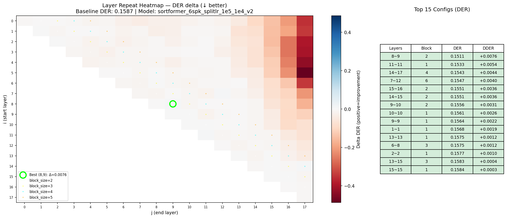
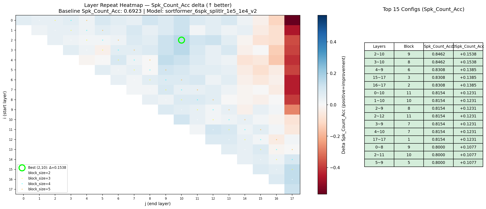

# Ultra-Sortformer: Extending NVIDIA Sortformer to N Speakers

[](https://huggingface.co/devsy0117/ultra_diar_streaming_sortformer_5spk_v1)
[](https://huggingface.co/devsy0117/ultra_diar_streaming_sortformer_8spk_v0)

This project documents the ongoing journey of extending **NVIDIA's Streaming Sortformer** speaker diarization model from 4 speakers toward 8 speakers — without retraining from scratch. The core idea is to surgically expand the output layer using orthogonal initialization, then fine-tune with differential learning rates to preserve existing knowledge while teaching the model new speakers.

> **Current status**: 5spk ✅ → 6spk ✅ → 7spk 🔄 → 8spk v0 ⚠️ (preliminary)
>
> An initial 4→8 direct extension (`8spk_v0`) was released on Hugging Face but showed unsatisfactory performance — motivating the current step-by-step approach to preserve quality at each stage.

---

## Table of Contents

1. [Background](#background)
2. [Architecture Overview](#architecture-overview)
3. [Extension Journey](#extension-journey)
   - [Step 1: Output Layer Extension (4 → 5spk)](#step-1-output-layer-extension-4--5spk)
   - [Step 2: Split Learning Rate Training](#step-2-split-learning-rate-training)
   - [Step 3: Layer Repeat Experiments (LLM Neuroanatomy)](#step-3-layer-repeat-experiments-llm-neuroanatomy)
   - [Step 4: Extending to 6–8 Speakers (In Progress)](#step-4-extending-to-6-7-8-speakers-in-progress-)
4. [Evaluation Results](#evaluation-results)
5. [Synthetic Training Data](#synthetic-training-data)
6. [Training](#training)
7. [Requirements](#requirements)

---

## Background

NVIDIA's [diar_streaming_sortformer_4spk-v2.1](https://huggingface.co/nvidia/diar_streaming_sortformer_4spk-v2.1) is a streaming speaker diarization model based on the Sortformer architecture. It uses a **FastConformer encoder** (17 layers) followed by a **Transformer encoder** (18 layers) to produce per-frame speaker activity predictions. The final output layer is a single linear layer mapping from hidden states to N speaker probabilities.

The model is capable of real-time streaming diarization using a chunk-based speaker cache mechanism.

**Problem**: The model is hard-limited to 4 speakers. Any audio with 5+ speakers gets misidentified.

**Goal**: Extend the model to handle 5, 6, and 8 speakers while preserving performance on the original 2–4 speaker scenarios.

---

## Architecture Overview

```
Audio Input
    │
    ▼
┌─────────────────────────────┐
│  Preprocessor               │
└─────────────────────────────┘
    │
    ▼
┌──────────────────────────────┐
│  FastConformer Encoder       │  ← 17 layers, d_model=512
│  (NEST Encoder)              │    Subsampling factor: 8
└──────────────────────────────┘
    │
    ▼
┌──────────────────────────────┐
│  Transformer Encoder         │  ← 18 layers, d_model=192
└──────────────────────────────┘
    │
    ▼
┌──────────────────────────────┐
│  SortformerModules           │  ← Speaker Cache + Attention
│  (Streaming Speaker Cache)   │
└──────────────────────────────┘
    │
    ▼
┌──────────────────────────────┐
│  single_hidden_to_spks       │  ← Linear(192, N_spk)  ← KEY LAYER
└──────────────────────────────┘
    │
    ▼
  Per-frame speaker activity predictions  [batch, time, N_spk]
```

The output layer `single_hidden_to_spks` is a simple `nn.Linear(192, N_spk)`. Extending the model to handle more speakers means expanding this layer from N to M outputs.

---

## Extension Journey

### Step 1: Output Layer Extension (4 → 5spk)

**Script**: `scripts/extend_output_layer.py`

The naive approach — random weight initialization for new speaker neurons — catastrophically degrades performance on existing speakers. Instead, we use **SVD-based orthogonal initialization**.

#### How it works

Given the existing weight matrix `W ∈ ℝ^{N×H}` (N speakers, H=192 hidden dims):

```python
# SVD decomposition of existing weights
U, S, Vh = torch.linalg.svd(W, full_matrices=True)

# New speaker neurons = right singular vectors orthogonal to existing ones
# Vh[N], Vh[N+1], ... are orthogonal to the column space of W
new_row = Vh[N]  # fully orthogonal to existing N speakers

# Normalize to match existing neuron norms
avg_norm = W.norm(dim=1).mean()
new_row = new_row * (avg_norm / new_row.norm())
```

This ensures new speaker neurons start as far as possible from existing ones in the representation space, minimizing interference during fine-tuning.

The extended model is saved in **split mode** for differential learning rates:

```
single_hidden_to_spks_base  (N_base speakers)   ← preserved weights
single_hidden_to_spks_new   (N_new speakers)    ← new/extended weights
```

---

### Step 2: Split Learning Rate Training

**Key Insight**: When fine-tuning the extended model, using the same learning rate for all output neurons causes the model to "forget" its existing 2–4 speaker accuracy while trying to learn the 5th speaker.

#### The Problem

Early experiments showed that after fine-tuning with a uniform learning rate:
- val_2spk → val_4spk: accuracy degraded significantly
- The model started predicting 5 speakers on 3–4 speaker audio

#### The Solution: Differential Learning Rates

We split the output layer and apply different learning rates:

| Component | Learning Rate | Reason |
|-----------|-------------|--------|
| `single_hidden_to_spks_base` (spks 1–N) | `1e-5` | Preserve existing knowledge |
| `single_hidden_to_spks_new` (spk N+1) | `1e-4` | 10× higher: fast adaptation |
| All other parameters | `1e-5` | Normal fine-tuning |

This is implemented by overriding `setup_optimizer_param_groups` in `sortformer_diar_models.py`:

```python
def setup_optimizer_param_groups(self):
    sm = self.sortformer_modules
    n_base = getattr(sm, 'n_base_spks', 0)
    new_lr = self._cfg.get('optim_new_lr', None)

    if n_base > 0 and new_lr is not None and hasattr(sm, 'single_hidden_to_spks_new'):
        new_params = list(sm.single_hidden_to_spks_new.parameters())
        new_param_ids = {id(p) for p in new_params}
        base_params = [p for p in self.parameters() if id(p) not in new_param_ids]
        self._optimizer_param_groups = [
            {"params": base_params},
            {"params": new_params, "lr": new_lr},
        ]
```

#### Training Command (5spk example)

```bash
python NeMo/examples/speaker_tasks/diarization/neural_diarizer/streaming_sortformer_diar_train.py \
  --config-path=/path/to/conf \
  --config-name=streaming_sortformer_diarizer_4spk-v2.yaml \
  +init_from_nemo_model=diar_streaming_sortformer_5spk_orthogonal.nemo \
  model.train_ds.manifest_filepath=/path/to/train.json \
  model.validation_ds.manifest_filepath=/path/to/val.json \
  model.train_ds.session_len_sec=180 \
  model.validation_ds.session_len_sec=180 \
  model.max_num_of_spks=5 \
  +model.sortformer_modules.n_base_spks=4 \
  model.lr=1e-5 \
  +model.optim_new_lr=1e-4 \
  batch_size=4 \
  trainer.devices=2
```

---

### Step 3: Layer Repeat Experiments (LLM Neuroanatomy)

Inspired by [dnhkng's RYS-XLarge](https://github.com/dnhkng/GlitchHunter) — which reached #1 on the Open LLM Leaderboard by duplicating 7 middle layers of Qwen2-72B without any weight modification — we applied the same technique to Sortformer's Transformer encoder.

**Script**: `scripts/layer_repeat_experiment.py`

#### Concept

For a model with L layers, configuration (i, j) means:
```
Original:   0 → 1 → 2 → ... → i → ... → j → ... → L
Repeated:   0 → 1 → ... → i → ... → j → i → ... → j → j+1 → ... → L
```
The block [i, j] is executed twice. No weights are changed.

#### Findings on Sortformer (18-layer Transformer)

We ran all (start, end) combinations with block sizes 1–18 across 65 real-world test samples (AliMeeting, AMI IHM/SDM, CallHome, K-domain, synthetic 6spk):

| Metric | Best block | Effect |
|--------|-----------|--------|
| DER | 8–9 (block=2) | Slight improvement on some real-world sets |
| Spk_Count_Acc | 14–17 (block=4), 2–10 (block=9) | +3–5% improvement |

**Hypothesis**: The 18-layer Transformer is compact enough that functional circuits overlap, but a rough anatomy emerges:

```
Layers  0–7 : acoustic feature encoding, cross-speaker attention
Layers  8–9 : core diarization reasoning (most sensitive)
Layers 10–13: speaker discrimination refinement
Layers 14–17: speaker count judgment (repeatable without major DER damage)
```

#### Heatmaps

DER heatmap (lower = better, repeating layers ~8–9 causes least degradation):



Speaker Count Accuracy heatmap (higher = better, layers 14–17 show improvement):




---

### Step 4.5: Permanent Layer Expansion Experiments

Based on the layer repeat findings, we permanently duplicated specific Transformer encoder blocks (using `scripts/expand_transformer_layers.py`) and evaluated each without any fine-tuning to assess the raw structural impact.

**Key insight**: Layer duplication without fine-tuning reliably increases MISS (the junction between original and copied blocks is untrained), but reveals which blocks drive which capabilities.

#### Models Tested

| Model | Duplicated Block | Layers after | Notes |
|-------|-----------------|--------------|-------|
| Base (no expansion) | — | 18 | Baseline |
| `expanded_L8-9` | [8, 9] | 20 | Core reasoning block |
| `expanded_L16-17` | [16, 17] | 20 | Output-adjacent block |
| `expanded_L14-17` | [14, 17] | 22 | Full speaker-count block |
| `expanded_L8-9_L14-17` | [8,9] + [14,17] | 24 | Combined |

#### Results Summary (eval on 65 real-world samples)

**DER (lower = better)**

| Model | val_5spk | val_6spk | AliMeeting | AMI IHM | AMI SDM |
|-------|---------|---------|------------|---------|---------|
| Base | 2.38% | 4.22% | 6.28% | 13.58% | 14.81% |
| L8-9 | 2.50% | 4.43% | 6.48% | **11.78%** | 17.21% |
| L16-17 | 2.29% | 5.07% | 7.04% | 14.98% | 20.14% |
| L14-17 | 3.64% | 7.18% | 7.59% | 15.26% | 17.74% |
| L8-9+L14-17 | 3.79% | 9.02% | 8.05% | 15.69% | 20.76% |

**Speaker Count Accuracy (higher = better)**

| Model | val_6spk | AliMeeting | AMI IHM | AMI SDM | CallHome avg |
|-------|---------|------------|---------|---------|-------------|
| Base | 69% | 80% | 43.75% | 50% | 79.6% |
| L8-9 | **71%** | 75% | 56.25% | 56.25% | 81.7% |
| L16-17 | 59% | 80% | 62.50% | 75% | **84.9%** |
| L14-17 | 52% | **90%** | **87.50%** | **87.50%** | 84.2% |
| L8-9+L14-17 | 50% | 85% | 75% | 81.25% | 84.9% |

#### Key Takeaways

- **L8-9** is the most balanced: smallest DER degradation on synthetic val, and AMI IHM DER actually *improves* (13.58% → 11.78%)
- **L14-17** dramatically boosts Spk_Count_Acc on real-world data (AMI IHM: 43.75% → 87.50%), confirming this block drives speaker count judgment — at the cost of higher DER without fine-tuning
- **Combined L8-9+L14-17** gives the best Spk_Count_Acc on CallHome but degrades synthetic val DER the most
- All expanded models require **fine-tuning** to recover DER, particularly the untrained junction between original and duplicated layers

**Recommended next step**: Fine-tune `expanded_L8-9` as it shows the least raw degradation and has already demonstrated AMI IHM improvement pre-fine-tuning.

---

### Step 4: Extending to 6, 7, 8 Speakers (In Progress 🔄)

A direct 4→8 extension (`8spk_v0`) was attempted first but produced unsatisfactory performance. The iterative approach was adopted to progressively build quality at each speaker count before moving to the next.

Each step starts from the previous model:

```
4spk (NVIDIA baseline)
  └─ extend_output_layer.py → fine-tune (split LR)
       └─ 5spk ✅
            └─ extend_output_layer.py → fine-tune (split LR)
                 └─ 6spk ✅
                      └─ [layer repeat experiments + permanent expansion]
                      └─ extend_output_layer.py → fine-tune (split LR)
                           └─ 7spk 🔄
                                └─ extend_output_layer.py → fine-tune (split LR)
                                     └─ 8spk v1 (planned, supersedes v0)
```

For each step:
```bash
# 1. Extend output layer
python scripts/extend_output_layer.py \
    --src <N>spk_model.nemo \
    --dst-spk $((N+1)) \
    --out $((N+1))spk_split_output.nemo

# 2. Fine-tune with split learning rate
python NeMo/examples/.../streaming_sortformer_diar_train.py \
    +init_from_nemo_model=$((N+1))spk_split_output.nemo \
    model.max_num_of_spks=$((N+1)) \
    +model.sortformer_modules.n_base_spks=$N \
    model.lr=1e-5 \
    +model.optim_new_lr=1e-4
```

Training data for each step uses 200 sessions per dataset (synthetic 2–Nspk + AliMeeting + AMI IHM + AMI SDM), ensuring no overlap with data used in previous steps.

---

## Synthetic Training Data

All synthetic data is generated from **Korean TTS speech** using `scripts/sentence_level_multispeaker_simulator.py`, a customized version of NeMo's [`multispeaker_simulator.py`](https://github.com/NVIDIA/NeMo/blob/main/tools/speech_data_simulator/multispeaker_simulator.py). The original script was modified to operate at the **sentence level** — interleaving complete single-speaker utterances rather than splitting at the word/phoneme level — which better reflects natural conversational turn-taking. It creates multi-speaker sessions with controlled silence and overlap ratios.

### Source Data

Single-speaker utterances are sourced from the **[다화자 음성합성 데이터 (Multi-speaker Speech Synthesis Dataset)](https://www.aihub.or.kr/aihubdata/data/view.do?aihubDataSe=data&dataSetSn=542)** provided by [AI-Hub](https://www.aihub.or.kr) (한국지능정보사회진흥원, NIA). This dataset contains recordings from 3,400+ Korean speakers across diverse age groups (10s–60s), totaling 10,152 hours of speech.

| Source | #Utterances | Language |
|--------|-------------|----------|
| `multispeaker_speech_synthesis_data/Training` | 8,666,803 | Korean |
| `multispeaker_speech_synthesis_data/Validation` | 1,225,244 | Korean |

### Generated Datasets

Two overlap variants were generated for 2–8 speakers to study robustness to overlapping speech:

- **`ov0.05`** — 1,000 training sessions × 2–8 spk (180s), 100 validation sessions × 2–8 spk (90s), ~5% overlap
- **`ov0.15`** — 1,000 training sessions × 2–8 spk (180s), ~15% overlap (harder conditions)

All sessions use ~10% mean silence. Overlap and silence ratios are means; individual sessions vary (std ~9–10%).


---

## Evaluation Results

Comparison of `ultra_diar_streaming_sortformer_5spk_v1.0` vs the base model `diar_streaming_sortformer_4spk-v2.1`.

### Evaluation Parameters

| Parameter | Value |
|-----------|-------|
| Post-processing | None |
| Collar | 0.25s |
| Ignore overlap | False |
| Chunk size | 340 frames |
| Batch size | 1 |

### AliMeeting (test)

| Model | DER | FA | MISS | CER | Spk_Count_Acc |
|-------|-----|----|------|-----|---------------|
| diar_streaming_sortformer_4spk-v2.1 (base) | 11.03% | 0.40% | 9.93% | 0.70% | 95.00% |
| ultra_diar_streaming_sortformer_5spk_v1.0 | **5.85%** | 1.03% | 3.80% | 1.01% | 65.00% |

### AMI IHM (test)

| Model | DER | FA | MISS | CER | Spk_Count_Acc |
|-------|-----|----|------|-----|---------------|
| diar_streaming_sortformer_4spk-v2.1 (base) | 26.05% | 0.50% | 23.51% | 2.03% | 93.75% |
| ultra_diar_streaming_sortformer_5spk_v1.0 | **10.98%** | 1.48% | 7.79% | 1.71% | 68.75% |

### AMI SDM (test)

| Model | DER | FA | MISS | CER | Spk_Count_Acc |
|-------|-----|----|------|-----|---------------|
| diar_streaming_sortformer_4spk-v2.1 (base) | 28.29% | 0.82% | 23.76% | 3.72% | 93.75% |
| ultra_diar_streaming_sortformer_5spk_v1.0 | **14.33%** | 2.09% | 8.33% | 3.91% | 87.50% |

### CallHome (test)

| Model | eng | deu | jpn | spa | zho |
|-------|-----|-----|-----|-----|-----|
| diar_streaming_sortformer_4spk-v2.1 (base) DER | 4.94% | 6.70% | 10.03% | 23.27% | 7.15% |
| ultra_diar_streaming_sortformer_5spk_v1.0 DER | 7.39% | 6.98% | 10.59% | **17.92%** | 9.24% |
| diar_streaming_sortformer_4spk-v2.1 (base) Spk_Acc | 83.57% | 80.83% | 79.17% | 63.57% | 72.86% |
| ultra_diar_streaming_sortformer_5spk_v1.0 Spk_Acc | **87.86%** | **86.67%** | **83.33%** | **72.14%** | 72.86% |

> **Note**: The base model (v2.1) is hard-limited to 4 speakers. The DER improvement on AliMeeting and AMI reflects the reduced MISS rate from correctly predicting 5th speaker activity. Lower `Spk_Count_Acc` on some datasets reflects the trade-off of extending to 5-speaker support.

---

## Training

### NeMo Modifications

This project requires modifications to NeMo's Sortformer implementation:

**`nemo/collections/asr/models/sortformer_diar_models.py`**
- Added `setup_optimizer_param_groups()` override for differential learning rates

**`nemo/collections/asr/modules/sortformer_modules.py`**
- Added `n_base_spks` parameter to enable split output layers (`single_hidden_to_spks_base` + `single_hidden_to_spks_new`)

**`nemo/collections/asr/data/audio_to_diar_label.py`**
- Fixed `_eesd_train_collate_fn` to handle mixed 1D/2D (mono/stereo) audio tensors in batches

### Training Configuration

Key YAML settings (`configs/streaming_sortformer_diarizer_4spk-v2.yaml`):

```yaml
model:
  max_num_of_spks: 6       # Set to target speaker count
  lr: 1e-5                 # Base learning rate
  # optim_new_lr: 1e-4     # Add via CLI: +model.optim_new_lr=1e-4

  sortformer_modules:
    num_spks: ${model.max_num_of_spks}
    # n_base_spks: 5       # Add via CLI: +model.sortformer_modules.n_base_spks=5
```

---

## Requirements

```bash
# NeMo (clone separately, ~5.9GB)
git clone https://github.com/NVIDIA/NeMo.git
pip install -e NeMo/[asr]

# Other dependencies
pip install torch torchaudio
pip install soundfile librosa
pip install pyannote.metrics
```

---

## License

This model is a derivative of NVIDIA Sortformer, licensed under the [NVIDIA Open Model License](https://www.nvidia.com/en-us/agreements/enterprise-software/nvidia-open-model-license/).

**Attribution**: Based on work by NVIDIA Corporation.
